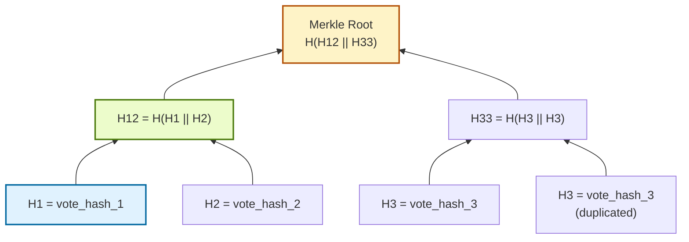

## Merkle Tree Diagram 
In this project, each leaf of the tree is a `vote_hash`.  
If the number of leaves is odd, the last hash is duplicated to build the upper level.

### How the Root is Computed
For three votes:

- `H1 = SHA-256(vote_hash_1)`
- `H2 = SHA-256(vote_hash_2)`
- `H3 = SHA-256(vote_hash_3)`
- because the number of leaves is odd, the last leaf is duplicated
- `H12 = SHA-256(H1 + H2)`
- `H33 = SHA-256(H3 + H3)`
- `MerkleRoot = SHA-256(H12 + H33)`

### Example Proof Path
If a voter wants to verify that `vote_hash_1` is included in the block, the system returns the sibling hashes needed to reconstruct the root:

- sibling on level 1: `H2`
- sibling on level 2: `H33`

So the verification path is:

1. start with `H1`
2. compute `H12 = SHA-256(H1 + H2)`
3. compute `MerkleRoot = SHA-256(H12 + H33)`
4. compare the computed root with the `merkle_root` stored in the block

If both roots match, the vote is confirmed to be included in the ledger.
### What This Proves
This mechanism allows the voter to prove that the vote was included in a committed block:

- without revealing the original voter ID
- without exposing all other votes in the block
- using only the vote hash, proof path, and Merkle root from the ledger
